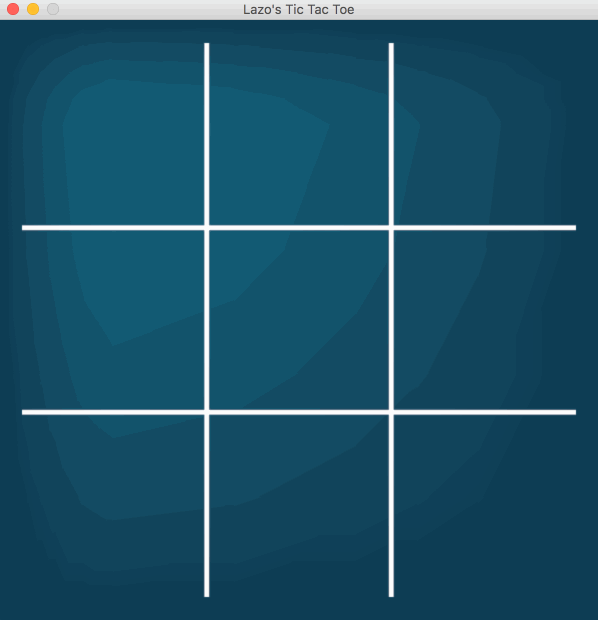
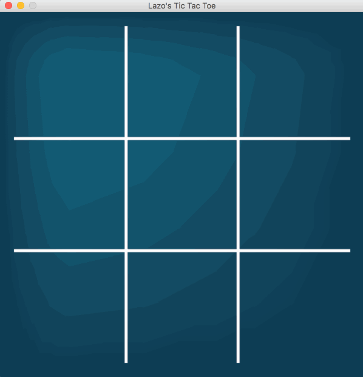
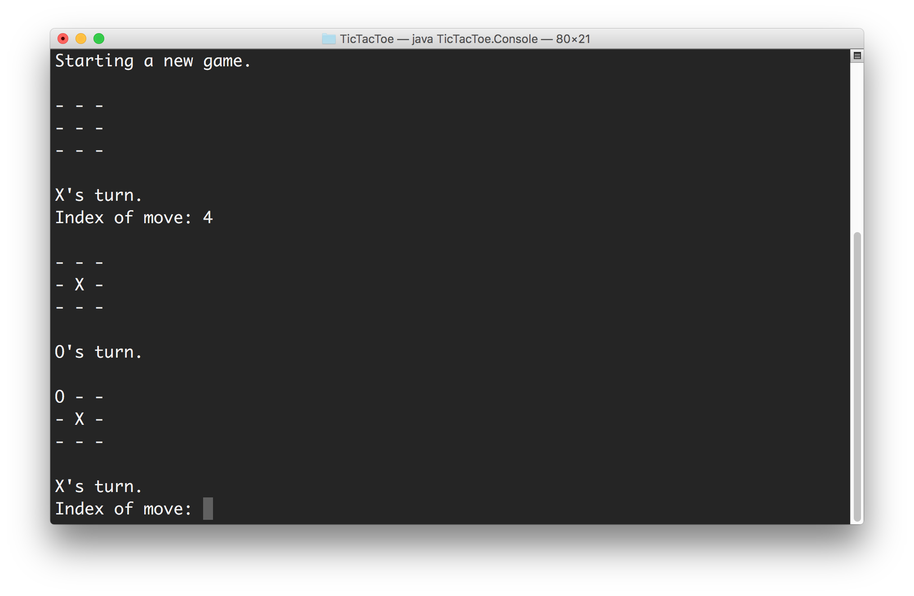

# Tic-Tac-Toe
An unbeatable game of Tic Tac Toe. The AI uses a tweaked <a href="https://en.wikipedia.org/wiki/Alpha%E2%80%93beta_pruning">Alpha-Beta Pruning</a> algorithm for the decision making.

# Gameplay

The AI cannot be defeated. Every game either ends in a draw or the AI winning.


# What I Learned

## Alpha-Beta Pruning has a "Flaw"

Vanilla Alpha-Beta Pruning sometimes leads to unexpected results such as the following:



You can see in the above gif that the AI could have won by playing an *O* in the bottom left corner but it instead chose the middle cell in the first column. This may seem a little strange but no matter what move I choose afterwards, it still wins.

What I found was that even though Alpha-Beta Pruning based AI plays perfect games, occassionally it chooses to make a move where the outcome will be a slower victory or a quicker loss. By tweaking the algorithm a little bit and including search depth in its board evaluation I was able to get it to always choose the quickest victory or the slowest loss.

The following is what the tweaked Alpha-Beta Pruning algorithm does:



As you can tell, this time it chooses the path of quickest victory.

## Quantity of Boards Evaluated

When using a regular MiniMax algorithm the AI checks **59,704** possible board combinations for its first move (this number obviously decreases throughout the game as less cells are available). The Alpha-Beta Pruning on the other hand brings this number down to **2,337**. Adding the tweak that I mentioned above brings the number up slightly to **2,787**. This increase is miniscule in comparison to the advantages that the algorithm brings to the table.

# Instructions
After downloading, navigate into the folder that contains the packages *ArtificalIntelligence*, *Assets*, *TicTacToe*, and *Results.txt*. Then type the following commands to run the game in Window mode:
```
javac Window.java
java TicTacToe.Window
```
Typing in any parameter will run the game in Player vs. Player mode. Example:
```
java TicTacToe.Window -pvp
```
To run the game in the console, without a GUI, type:
```
java TicTacToe.Console
```
The console version takes in the player input by index. This means that to select position (1, 1), the index would be 4 since it is the 5th square but we are using zero based indexing.



Console mode does not support Player vs. Player.
